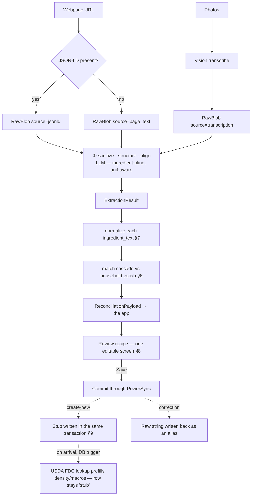

**Status:** Shipped (step 8) · re-traced against the tree 2026-08-31 · **Scope:** Ansi v1 · **Supersedes:** spec §5 (Import) mechanics
**One-liner:** Imports run online, so matching is a server-side job — the phone never fuzzy-matches. Extraction proposes, a human confirms, and corrections quietly grow the vocabulary.

> §3, §4, §6, §8 and §9 were rewritten at the step-8 close-out to describe **what
> shipped**, not what was planned. The pipeline that landed differs from the
> original draft in four ways worth knowing before you read on: there is **one
> forced LLM path** (JSON-LD is a cheaper *input*, never an LLM-free bypass);
> extraction is **ingredient-blind but unit-aware**; there is **no silent
> auto-stub** (a no-match surfaces to the user); and reconciliation is **one
> merged editable screen**, not the three-state triage the draft described.
> §5, §7 and §10 stand as written. The build is recorded in exec plans
> [0014](../exec-plans/completed/0014-import-foundation.md)–[0019](../exec-plans/completed/0019-import-integration.md).

---

## 1. Scope

This doc details two things the main spec left open: how ingredients are stored for matching, and how imported recipe lines are reconciled against them. It covers the full path from "paste a link / take a photo" to "recipe committed with every line resolved to a known ingredient or a stub."

**In scope:** intake, extraction, normalization, the match cascade, the reconciliation screen's data contract, the stub lifecycle, and the offline story.
**Out of scope:** the recipe page/cook mode UI, meal planning, the batch cook plan, and the shopping list (all covered elsewhere). The chip *rendering* lives with the recipe page, but the step storage model and the import-time alignment that feed it are specified here (§4.6). The unit system is assumed to exist already — it does not, everything here depends on it (spec §4, "build FIRST").

---

## 2. Key architectural decision — matching is online-only

Matching only ever happens at **import time**, and import is **always online** (we're either calling a vision model or fetching a webpage). Nothing offline needs to fuzzy-match: browse, cook, plan, and shop all operate on data that was already resolved at import.

This single observation removes the two hardest problems:

- No on-device embedding model.
- No shipping an 8,000-row reference vocabulary to the phone.

**Consequence:** the entire match engine lives server-side (Supabase Edge Function or Postgres RPC). PowerSync syncs only the human-readable, already-resolved ingredient rows down to the device for browse/cook. The match index and the large USDA reference set stay on the server.

Keep two paths mentally separate; they are different problems (see §10):

- **Machine proposes → human confirms** = import reconciliation. Online. Fuzzy.
- **Human picks directly** = the "Add ingredient" search screen during manual recipe editing. Offline. Exact/prefix lookup over a small synced set.

### ADR-0004, reaffirmed by the step-8 build (2026-08-31)

Step 8 changed the *shape* of extraction — one forced LLM path, and the LLM now
also does within-recipe step→line alignment — which touches ADR-0004's wording
closely enough to be worth stating explicitly:

**[ADR-0004](../decisions/0004-matching-is-online-only.md) stands, unamended.**
Matching is still deterministic and still server-side; the model still never sees
the ingredient vocabulary and still never matches. What it gained is *unit*
awareness (`UnitHints` — the canonical unit catalog, accepted imprecise words,
size adjectives, and generic count-measure nouns; never the ingredient vocab and
never the per-ingredient measure table) and *within-recipe* alignment (which line
of **this same extraction** a step word points at, by index — no vocabulary is
consulted, so the rule holds).

Per the knowledge-base rule that decisions are immutable, this is deliberately a
**note in the spec, not a new ADR and not an edit to ADR-0004**: nothing was
reversed or superseded, so there is no decision to record. A new ADR becomes
warranted only if the back-pocket option in
[0014](../exec-plans/completed/0014-import-foundation.md)'s decision log is ever
taken — putting an LLM over the household vocab to close a synonym gap — because
*that* would reverse ADR-0004's core claim.

---

## 3. Pipeline overview

Webpage and photo diverge only at **intake**. From the `RawBlob` on, every source
runs the identical path — including the LLM stage. **JSON-LD is a cheaper input,
not a bypass**: it feeds better text into the same sanitize call.



The stages, and who owns each:

| # | Stage | Where | Deterministic? |
|---|---|---|---|
| 1 | **Intake** — URL → JSON-LD or page text; photos → a faithful vision transcription | `_shared/jsonld.ts`, the adapter's `transcribe` | fetch/parse yes; transcribe no (LLM) |
| 2 | **① sanitize · structure · align** — `RawBlob` → `ExtractionResult` (§4) | the `ExtractAdapter` (Claude Haiku 4.5) | no — always an LLM |
| 3 | **Normalize** — `ingredient_text` → `match_text` (§7) | `_shared/normalize.ts`, called **inside** `match.ts` | yes |
| 4 | **Match** — the cascade, bands + candidates (§6) | `_shared/match.ts` + the Postgres seam `match_db.ts` | yes |
| 5 | **Reconcile** — one merged editable review screen (§8) | `app/lib/features/import` | human |
| 6 | **Commit** — recipe, groups, lines, stubs, aliases in one local transaction; step refs remapped index → `line_item_id` | `SqliteImportRepository.commit` | yes |

Stages 1–4 are the `import-recipe` edge function; 5–6 are the app. The boundary
between them is the `ReconciliationPayload` — the frozen contract in
`supabase/functions/_shared/types.ts`, mirrored in Dart and pinned by a golden
payload test on both sides.

**The invariant that runs through all six: never invent.** No fabricated
ingredient, quantity, unit, time, serving count or step. Absent or ambiguous ⇒
flagged (`parse_warnings`, low `confidence`, a preserved range the user resolves)
— never guessed. This is why a human sits in the loop at stage 5, and it is a
scored, disqualifying dimension of the provider benchmark.

---

## 4. Extraction

**One forced LLM path.** Every import — JSON-LD, page text, or photo — runs through
the same single LLM stage, **① sanitize · structure · align**. The original design
had JSON-LD skip the model entirely; that was dropped in
[0014](../exec-plans/completed/0014-import-foundation.md) for three reasons: it
halved the code paths to test, it removed the awkward gap where a JSON-LD import
had no step→ingredient chips (nothing had aligned them), and import was
online-only anyway (§2), so a "no-LLM" path bought no capability. JSON-LD's real
value survives intact — it is *much better input*, so extraction quality is
higher and the token bill lower.

### 4.1 Webpage

Fetch the URL and parse **every** `schema.org/Recipe` JSON-LD block →
`RawBlob{source: "jsonld"}`. Absent or malformed ⇒ fall back to the page's text →
`RawBlob{source: "page_text"}`. Both are inputs to ①, not outputs. The parser is
ported from the seed pipeline's `mine_recipes.ts`, which already did this job.

### 4.2 Photo (incl. multi-page)

Photos go through a **faithful-transcription** vision call first (image bytes →
`RawBlob{source: "transcription", text}`), then the *same* ① as everything else.
Two calls, deliberately: transcription and structuring are different skills with
different failure modes, and splitting them lets the transcription model change
without touching the structuring prompt. Multi-page is in scope — all page images
go in a single vision call and the model merges them into one transcription.

The phone downscales each page to a longest edge of ~1,568 px and re-encodes as
JPEG before upload (off the UI isolate; any decode failure passes the original
bytes through rather than failing the import). The server repeats the downscale as
a safety net. A raw 12 MP photo is wasted tokens and risks the edge payload limit.

### 4.3 Model choice

**Claude Haiku 4.5** (`claude-haiku-4-5`), and it was chosen by measurement, not
taste: lane D ([0018](../exec-plans/completed/0018-import-benchmark.md)) scored
three providers against 11 human-blessed gold labels and the web corpus —
**98.9% line-F1 vs GPT-5.4-mini's 93.4%**, whose recall collapses on dense
recipes. At household volume the cost is a rounding error either way ($1 / $5 per
million input / output tokens), so quality and never-invent behaviour decided it,
not price. Prompt caching on the static instruction block keeps repeat imports
cheap.

**The model does not see the ingredient vocabulary and does not match** (ADR-0004,
§2). It *is* unit-aware: `UnitHints` hands ① the canonical unit catalog, accepted
imprecise words (`pinch`, `dash`, `handful`, `to taste`), size adjectives, and the
generic count-measure **nouns** (`clove · head · sprig · loaf · block · slice ·
can · bunch · stalk`) — so "2 garlic cloves" lands as `unit: "clove"` instead of
being force-fit onto `piece`. Those nouns are counting words. The per-ingredient
gram/ml basis that rides on *one* ingredient (a garlic clove ≈ 3 g, a 400 g can)
is **not** in the hints and never reaches the model.

Use the provider's **native structured-output / JSON-schema mode**, not a "please
reply in JSON" instruction — the review screen needs guaranteed-parseable output.

### 4.4 Extraction output contract

The authoritative definition is `supabase/functions/_shared/types.ts`
(`ExtractionResult`); this is that shape, annotated. The
`ReconciliationPayload` the app receives is the same object with each line
wrapped as `{raw, band, candidates}` (§6).

```jsonc
{
  "title": "Weeknight Chicken Curry",

  // --- Servings & yield: attempt a number, flag when genuinely unclear -------
  "servings_base": 4,                 // number | null — null ⇒ the UI asks the user
  "servings_raw": "Serves 4–6",       // string | null — the printed text, verbatim
  "yield_raw": null,                  // "Makes 1 cup" — a yield that ISN'T portions

  // --- Printed times. A single value is a number; a printed range is a pair --
  "total_time_seconds": 3600,         // number | {low_seconds, high_seconds} | null
  "cook_time_seconds": { "low_seconds": 900, "high_seconds": 1200 },

  // --- Honesty flags (never-invent) -----------------------------------------
  "truncated": false,                 // the SOURCE was deliberately incomplete
  "image_quality": "ok",              // ok | degraded | poor
  "parse_warnings": [],               // e.g. "text cut off at bottom"

  "groups": [
    {
      "name": "for the curry",        // string | null when the recipe isn't grouped
      "line_items": [
        {
          "qty": 900,                 // number | null — null when a range, below
          "qty_low": null,            // "4 to 6" → 4
          "qty_high": null,           // "4 to 6" → 6   (never collapsed to one number)
          "unit": "g",                // catalog unit id when it maps; else the printed word
          "unit_mappable": true,      // false ⇒ `unit` holds a raw phrase for the UI to resolve
          "ingredient_text": "chicken thighs, boneless",  // identity, AS WRITTEN
          "notes": null,              // non-identity prep/usage: "juiced" | "zested"
          "raw_amount": "900g",       // the full printed amount, verbatim — never lost
          "optional": false,
          "confidence": 0.97          // model self-reported, per line
        }
      ]
    }
  ],

  // --- Tokenized method; refs are by FLATTENED LINE INDEX here (§4.6) --------
  "steps": [
    { "tokens": [
        { "t": "text", "s": "Dice the " },
        { "t": "ref", "refs": [3], "label": "onion",
          "mention": "new",           // new | rementioned | fraction
          "portion": null },          // optional sub-amount, transcribed from the step
        { "t": "text", "s": " and soften for " },
        { "t": "timer", "low_seconds": 600, "high_seconds": 900 }
      ] }
  ]
}
```

Five fields carry the never-invent invariant, and they are the ones to preserve if
this contract is ever touched:

- **`qty_low`/`qty_high`** — a printed range is kept as a range. The *user* picks
  the number at review; nothing auto-picks.
- **`unit_mappable: false`** — the printed amount didn't map to our catalog, so
  `unit` holds the raw phrase and the UI resolves it. Better an honest "needs you"
  than a force-fit unit.
- **`raw_amount`** — always the full printed amount, verbatim. Whatever ① decides
  about `qty`/`unit`, the source text survives, and the review screen shows it
  beneath the line ("from source: …").
- **`servings_base: null` + `servings_raw`** — "Makes 1 cup" is a real null, not a
  guessed 4.
- **`truncated`**, **`image_quality`**, **`parse_warnings`**, per-line
  `confidence` — the shaky-import signals, asked of the model in the same call.
  They are rendered at the top of the review screen, never swallowed.

Two more shape notes: `notes` splits non-identity prep off the identity string
("Juice of 1 lemon" → the **lemon** is the ingredient, `notes: "juiced"` — so
shopping buys a lemon and never invents a juice volume); and **timers are tokens,
not a step field**, because one step can print three of them.

### 4.5 Cross-model consensus — deferred, with conditions

We considered running two models and comparing outputs to flag hard-to-parse cases. **Deferred**, because:

- Outputs are rarely textually identical even when both are correct ("2 garlic cloves" vs "2 cloves garlic"), so a naive string diff false-positives constantly and forces a semantic diff engine — the actual work, and its own source of bugs.
- The failure mode we care about (blurry photo) is exactly where two models can **agree and both be wrong** — correlated errors defeat the premise.
- There's already a human in the loop at reconciliation, so a disagreement flag gates nothing; it's a nice-to-have, not load-bearing.

**Cheaper flags we get first:** the model's self-reported `image_quality`/`confidence` (§4.4), and a high no-match rate at reconciliation (half the lines unmatched ≈ a parse that went sideways).

**If** the calibration eval (§11) shows bad images still slipping through unflagged, add a **coarse, document-level** consensus check between two *different* models: same ingredient count? same step count? quantities within ~10%? If those broad strokes disagree, flag the whole import "review carefully" and float it to the top of the queue. Never do per-line reconciliation between the two models — that's where effort-to-value collapses.

### 4.6 Step ↔ ingredient references ("chips")

Steps render with inline ingredient chips, and cook mode highlights the same references larger. The feature is easy *only* if the link from a step word to an ingredient is stored as **data**, not detected at render time. Runtime free-text detection would drag the exiled matching problem back onto the device (and it runs offline) — don't.

**Storage — tokenized steps, not strings.** A step is an ordered list of tokens: plain-text spans interleaved with ref tokens. A ref carries the line item(s) it points at and the surface label to show; it never stores a quantity.

```jsonc
{
  "tokens": [
    { "t": "text", "s": "Combine the " },
    { "t": "ref",  "refs": ["<line_item_id>", "<line_item_id>"], "label": "dry ingredients" },
    { "t": "text", "s": " in a bowl. Dice the " },
    { "t": "ref",  "refs": ["<line_item_id>"], "label": "onion" },
    { "t": "text", "s": " and soften." }
  ],
  "timer_seconds": 600
}
```

**The LLM only ever chooses a reference, never a number.** Chip quantities are looked up live from the referenced line item and scaled with everything else. The model picks *which* line item a word refers to; it never supplies the amount — so a chip can't invent or drift from a wrong quantity, and numbers can never contradict the ingredient list. The worst failure is a chip pointing at the wrong ingredient: visible on the page, one tap to fix.

**Alignment is by index, not vocabulary.** In the extraction call the model already has both the steps and the recipe's own ingredient lines, so it grounds each mention to a line item **by index into that same extraction** (§4.4). This is *not* vocabulary matching — it never touches the household vocab, so the §4.3 rule holds. On commit, indices remap to real `line_item_id`s. Because refs point at line items, chips inherit vocabulary resolution for free: once a line item resolves to "Yellow onion" at reconciliation, every chip referencing it shows that; a stub line item still chips fine (name only, no macros — consistent with the honest-numbers rule).

**Collective references — the "dry ingredients" case.** A ref may point at a *set* of line items. Two render rules keep this safe:

- **Quantity shows only on a single-ingredient chip.** A collective chip ("the dry ingredients") is a highlight aid with no number — you can't meaningfully sum flour + baking soda across units anyway, so the risky wrong-quantity mode simply doesn't exist for collectives. A wrong *member* is low-stakes and editable.
- **`mention` decides whether a chip shows a number, and the model classifies it.**
  The draft's heuristic — "the first reference carries the number" — turned out to
  be brittle (recipes reorder, and a first mention is often the incidental one), so
  the shipped contract asks the model directly:
  `mention: "new" | "rementioned" | "fraction"`. A `new` mention renders the line's
  scaled quantity; a `rementioned` one renders quantity-less ("add the rest of the
  stock"); `fraction` marks a partial use. **The model still never emits a number** —
  it classifies the phrase, and the chip derives its amount live from the line item.

- **A ref may carry an optional `portion`** — the sub-amount the step itself names
  (`{qty, qty_low, qty_high, unit, qualifier}`). This was a deferred extension in
  the draft; the parsley case ("2 tbsp + ½ cup parsley" used across three steps)
  forced it into the frozen contract. It stays inside never-invent because the
  number is **transcribed from the step text**, never computed: a relative word
  ("half", "the rest", "for garnish") lands in `qualifier` and renders relative,
  with no made-up amount. If the step portions don't sum to the line total, that is
  **flagged**, never reconciled by inventing.

  A ref's displayed number is therefore a three-step fallback: `portion` if the
  step named one → else the line's scaled quantity on a `new` mention → else
  quantity-less. `portion: null` (the common case) behaves exactly as the draft
  described.

  *Worked example — split usage.* With 200 ml cream in the list and no portion
  tagged, "Add half of the **cream `200 ml`**" then "Add the rest of the
  **cream**". The number reflects the ingredient list and scales cleanly (double →
  400 ml, "half" still reads "half"), at the cost of slightly overstating the first
  mention — which a `portion` now fixes when the step spells the amount out.

- **Rendering is a structured token fold, never a text match.** The recipe page
  folds `text` / `ref` / `timer` tokens into widgets. Detecting ingredient names in
  prose at render time would drag the exiled matching problem back onto the device,
  offline — precisely what ADR-0004 forbids.

**Degradation.** Any mention the model won't confidently link stays plain text. A step with zero refs is still a good step; a recipe with zero chips is still a good recipe. Prompt the model to link only when confident. Two cases lean on this deliberately: a "pinch of salt" with no matching line stays text (never fabricate a line for it), and a **sub-recipe reference** ("Romesco Aioli (page 38)") stays text — nested recipes are a deferred feature, tracked in the [tech-debt tracker](../exec-plans/tech-debt-tracker.md).

**Editing — not built.** The manual editor was to get an @-mention picker (tap an ingredient to drop a chip; same token model, authored by hand). It stayed stretch in [0017](../exec-plans/completed/0017-import-client.md) and did not ship: the editor's method field is the plain-text `steps` shape, so a tokenized method is **preserved on save but not editable**. Tracked.

---

## 5. Ingredient storage

### 5.1 Two-tier vocabulary — the biggest quality lever

Separate the thing you **match against** from the thing you **search when creating**:

- **`ingredient`** — the household's curated, lean vocabulary (~150–300 rows in practice). This is the match target and the only ingredient data that syncs to devices. Seeded small; grows through imports and stubs.
- **`usda_food`** — the full USDA FoodData Central reference (Foundation Foods + SR Legacy, CC0), read-only, **server-side only**. Used for the "create a new ingredient" search and for background stub prefill (§9). **Never matched against during import.**

Matching against 8,000 SR Legacy rows — where "chicken thigh" appears fifteen ways — produces constant wrong matches. Matching against the couple hundred ingredients the household actually uses is high-precision and easy. USDA is a lookup for *creation*, not a match target.

### 5.2 Data model

Extends spec §4's `ingredient`. Aliases become their own table (not the `aliases[]` array) so they can be trigram-indexed and so corrections write back cleanly.

```sql
-- household vocabulary: match target + syncs to device
create table ingredient (
  id              uuid primary key,
  household_id    uuid not null references household(id),
  canonical_name  text not null,
  category        text,
  default_unit    text not null,
  density_g_per_ml numeric,          -- nullable; stub until set
  macros          jsonb,             -- {kcal, protein, carb, fat}; nullable
  status          text not null,     -- 'complete' | 'stub'
  source          text,              -- 'usda_fdc:<id>' | 'manual' | 'barcode' | 'import_stub'
  match_text      text not null      -- normalized form of canonical_name (see §7)
);

create table ingredient_alias (
  id            uuid primary key,
  ingredient_id uuid not null references ingredient(id) on delete cascade,
  alias_text    text not null,       -- as originally seen/entered
  match_text    text not null,       -- normalized form
  source        text not null        -- 'seed' | 'import_correction' | 'manual'
);

-- read-only reference; server-side only; NOT synced, NOT matched at import
create table usda_food (
  fdc_id        int primary key,
  description   text not null,
  category      text,
  density_g_per_ml numeric,
  macros        jsonb,
  match_text    text not null
);

-- trigram indexes power the fuzzy cascade
create index ing_match_trgm   on ingredient       using gin (match_text gin_trgm_ops);
create index alias_match_trgm on ingredient_alias using gin (match_text gin_trgm_ops);
create index usda_match_trgm  on usda_food        using gin (match_text gin_trgm_ops);

-- optional, only if embeddings earn their place (see §6)
-- alter table ingredient add column embedding vector(384);
-- create index ing_embed_hnsw on ingredient using hnsw (embedding vector_cosine_ops);
```

`match_text` is computed by the normalization function on write (§7), not a pure generated column — normalization is more than lowercasing.

### 5.3 What syncs vs what stays server-side

| Data | Syncs to device? | Purpose |
|---|---|---|
| `ingredient` (resolved rows) | Yes | Browse, cook, manual "Add ingredient" search |
| `ingredient_alias` | Yes | Improves offline typo-tolerant search; small |
| `usda_food` | No | Server-only reference for creation + prefill |
| Match indexes | No | Server-only; matching is online |

---

## 6. The matching cascade

Server-side (`_shared/match.ts`), called once per import with all lines batched,
**scoped to the caller's household** — the `household_id` claim the auth hook
stamps into the JWT, never a value from the request body. Runs cheap-to-expensive
and stops when confident.

1. **Exact normalized** — `match_text` equality against `ingredient` +
   `ingredient_alias` (§7 `normalize` runs here, inside the cascade — the
   orchestrator delegates rather than double-normalizing). → `auto`.
2. **Trigram** — `pg_trgm similarity()` over `match_text`, best-per-ingredient,
   top-3. High → `auto`; mid → `suggest`.
3. **No match** → band `none`, **empty candidates**.

**There is no embedding tier**, and that is a decision, not an omission: with
well-seeded aliases plus the learning loop (§8), trigram covers the synonym cases
we actually hit. It stays back-pocket — if the eval ever shows a real synonym gap
trigram and learned aliases can't close, that is the moment to revisit (and, per
§2, to write a new ADR).

**There is also no silent auto-stub.** The draft had step 4 mint a stub from the
raw string automatically. It doesn't: `none` surfaces to the *user*, who searches
or creates. Auto-stubbing quietly grows the vocabulary with the model's phrasing
and takes the decision away from the human the whole design puts in the loop.

### Score bands → review-screen behaviour

The band no longer decides which *screen* a line lands on (there is one screen —
§8). It decides how the line **starts**.

| Band | Score | The line starts… |
|---|---|---|
| `auto` | exact hit, or trigram ≥ **0.85** | resolved to the top candidate, collapsed, editable |
| `suggest` | trigram **0.55 – 0.85** | unresolved, with the top-3 as "did you mean" chips |
| `none` | < 0.55 | unresolved and open — search the vocab, or create-new |

Constants live in `match.ts` (`BAND_AUTO_MIN`, `BAND_SUGGEST_MIN`, `TOP_N`).
Retrieval prunes below pg_trgm's default `%` floor (0.3) so the GIN index is used;
that floor is safely under `BAND_SUGGEST_MIN`, so it can never hide a candidate we
would have surfaced. The thresholds are calibration knobs for the eval, **not** a
merge gate — and note that a band is only the starting state: a line's *validity*
(matched · range picked · unit admitted) is recomputed independently, so an
auto-matched line can still be flagged and still block Save (§8).

---

## 7. Normalization — where match quality actually lives

Applied to both the incoming `ingredient_text` and, at write time, to every `canonical_name`/`alias_text` (producing `match_text`). Symmetric normalization is what makes the cascade work.

Rules:

- **Lowercase.**
- **Singularize** — "onions" → "onion". High value.
- **Drop leading quantity, container, and size words** — "2", "a can", "large": amount, not identity.
- **Strip prep verbs that never change identity** — chopped, diced, minced, sliced, grated — whether space- or comma-separated ("onions, diced" → "onion").
- **…EXCEPT a cut word inside a canned/tinned phrase, where it IS the product** — "canned diced tomatoes" → "tomato canned diced", but "2 diced tomatoes" → "tomato" (the fresh one). A can of diced and a can of crushed are different things on the shelf, which the gold conventions already rule (`evals/.../gold/_SCHEMA.md`: "Chopped/crushed/diced tomatoes (tinned) are DIFFERENT PRODUCTS") and the extraction prompt already honours; without this the matcher flattened them onto one row. Same shape as the `clove`/allium and `stick`/cinnamon carve-outs: the word's class depends on a noun sharing the phrase. The marker is the STATE word canned/tinned, never the measure "can" — "1 (28-oz) can chopped tomatoes" is unaffected. The active set is chopped + diced; "crushed" is held back only because it already holds the generic `tomato canned` key that the generated `seed_measures.sql` depends on.
- **KEEP a comma modifier when it's a form/state word** — "chicken thighs, boneless" → "chicken thigh boneless". Only prep modifiers are stripped; a form/state modifier stays (it changes what the thing is).
- **KEEP form/state words that do change identity** — this is the common own-goal. "fresh ginger" ≠ "ground ginger"; "coconut milk, canned" ≠ "coconut cream". Over-aggressive stripping collapses distinct ingredients.
- **Canonical word order: noun first, state words trailing** — so "fresh ginger" and "ginger, fresh" both land on "ginger fresh".

Worked examples:

| Raw | Normalized `match_text` |
|---|---|
| "2 large Onions, diced" | "onion" |
| "Chicken thighs, boneless" | "chicken thigh boneless" |
| "1 can coconut milk" | "coconut milk" |
| "fresh ginger, grated" | "ginger fresh" |

Implemented in `supabase/functions/_shared/normalize.ts` — the single shared
normalizer the cascade, the row writer, and the batch seed pipeline all call
(one source, or symmetry breaks). Its word sets are the strip/keep lists above;
the eval harness scores it against `evals/datasets/matching/cases.jsonl`.

**The app has a twin** (step 8.5, plan 0020 D6):
`app/lib/features/ingredients/domain/normalize.dart` ports the same phrase rules
to Dart, because the client writes `match_text` too — the picker's add-new, a
rename in the manager, and a new alias. Before the port those paths applied the
*character*-level rules only, so a locally created stub carried a `match_text`
the server would never have written and the next import's cascade missed it. The
two are pinned together by shared vectors
(`app/test/features/ingredients/normalize_vectors.json`, copied from
`normalize.test.ts`) — change one, change both, and extend the vectors, the same
habit `default_allowed_units()` and `defaultAllowedUnitSet` already keep. Since
the 8.5 close-out **every** client writer calls it, import's own commit
included — `SqliteImportRepository.commit` writes `normalizeMatchText` for both
the `import_stub` row and the correction alias, so a stub minted at review and
one minted in the manager land the same `match_text` the server would have
written.

---

## 8. Review & the learning loop

**One screen: "Review recipe".** The draft (and the design board's v3 frames)
described a triage screen showing only the lines that need you, then a preview,
then commit. Driving it for real, that split read as ceremony — what the user
wants is to *see the recipe* and fix it in place — so it merged. The shipped
screen is a single, always-editable surface: the honest-import warnings at the
top, every line a card, the read-only method fold below rendering the same recipe
a save would write, and Save at the bottom.

- **Cards are compact by default and expand in place.** Collapsed, a line reads as
  the three-part `amount · ingredient · notes` it will be stored as, plus a plain
  "why this needs you" label — "Match an ingredient", "Pick a supported unit", "Set
  the amount" — rather than a bare dot. Tapping anywhere opens the full edit card.
- **The source line is always visible** — `raw_amount` + `ingredient_text` as
  written, beneath the resolved values. From a photo you would otherwise have no
  way to check what the page actually said.
- **Amount editing reuses the 7.7 quantity + unit-chip sheet**, seeded from the
  raw line — so imported lines and hand-authored lines are edited by the same
  component, with the same guardrails.
- **Unit "did you mean" chips** appear inline when the current unit isn't one the
  matched ingredient admits (ADR-0008 `allowed_units` + its measures + the
  always-admitted imprecise words `pinch`/`dash`/`handful`/`to taste`).
- **Save is gated on all-valid.** A line is done when it is matched, any printed
  range has a picked number, and its unit is admitted. Until every line clears,
  Save is disabled and says how many still need you. `buildCommit` re-asserts this
  at the seam and throws rather than let a partial import reach PowerSync.
- **Never-invent flags are shown, not hidden**: parse warnings, a degraded image, a
  truncated source, and each line's own flags.

On Save, one local transaction writes the recipe (filed into the default book —
the Library renders books, so a book-less recipe would save into a place nothing
shows it), its groups and line items, any create-new stubs, and any correction
aliases; step refs are remapped from `line_index` to the created `line_item_id`s
(§4.6). Local PowerSync tables are SQLite **views**, so every write is a plain
INSERT — never `ON CONFLICT`.

**The learning loop — nearly free, and the highest-value low-effort feature in the
pipeline.** When a user corrects a match (rejects an auto-match and picks another,
or accepts a suggestion), the original raw string is written back as a new
`ingredient_alias` (`source = 'import_correction'`) on the chosen ingredient. Over
a few weeks the vocabulary absorbs the household's actual phrasing ("coco milk" →
Coconut milk, canned) and matching improves with zero ML.

> The **design board's** "Import & recipe view · v3" frames were re-traced from
> the shipped code on 2026-08-31 and are current again (locked). Two shipped
> details beyond the bullets above: the review header's zero-state reads
> **"looks good"** (not "0 to review"), and the Save button carries a third
> label — **"Nothing left to save"** — when every line has been dropped; each
> line also shows a `low confidence NN%` badge when the extractor's own
> confidence is low.

---

## 9. Stub lifecycle

```
band `none` line
   │
   ▼
the USER chooses "create new"        ← no silent auto-stub (§6)
   │
   ▼
stub row written CLIENT-SIDE, inside the commit transaction
  (status='stub', source='import_stub', density/macros null)
   │  · keyed by the coalescing key, so identical no-match lines
   │    in one import share ONE created ingredient
   │  · syncs up like any other local write
   │
   ├──► surfaces in the ingredients manager (step 8.5): a stub BAND on top
   │    of the whole vocabulary at `/ingredients` — not a separate queue
   │    screen, and no table (`status='stub'` is the whole mechanism)
   │
   └──► ON ARRIVAL, server-side: the `ingredient_usda_prefill` trigger
        (0014, + 0015's rename leg) searches usda_food by match_text and
        copies density + macros onto the row. It STAYS 'stub'.
   │
   ▼
user opens the stub in the manager → edits/fills density + macros →
  presses Confirm → status='complete'
```

**The prefill, precisely** (step 8.5, plan 0020 D7). It is an `after insert or
update of canonical_name` trigger on `ingredient` — a plpgsql port of
`prefillStubFromUsda`, whose TypeScript original was deleted in the same change
rather than left as a second way to write the row. It must be server-side
(`usda_food` never syncs — ADR-0005), and a trigger is the only thing that sees
a stub arriving through the PowerSync **upload queue**, which is the surface
that actually creates stubs. Four properties are load-bearing:

- **It can never fail the upload.** One indexed trigram probe (`usda_match_trgm`)
  with a 0.5 floor, wrapped in an exception block that swallows and logs. A stub
  whose prefill fails is just an un-enriched stub.
- **It fires for a BARE stub only** — no density, no macros, and
  `source in ('manual','import_stub')` (or null). That excludes `source='seed'`
  (so the seed's audited "honestly density-less" tail is never overwritten by a
  guess, and the onboarding clone pays no probe per row) and `off:<barcode>`
  (so Open Food Facts provenance is not replaced by a USDA id).
- **A rename re-runs it** (0015): fix "curry leafs" → "Curry leaves, fresh" and
  the lookup happens again — the bare-stub guard is what makes that safe.
- **A landed density extends `allowed_units`** through the companion
  `ingredient_density_unlocks_units` trigger (ADR-0009), so the unlocked family
  is not left locked by a list materialized before the density existed.

**Confirming is a human act** (plan 0020 D5). Nothing promotes a row to
`complete` on its own — not a trigram hit, not a barcode scan. **Macros are the
gate; density is not**: the Confirm CTA is disabled without macros and the
repository refuses the same call, while a row with macros and no density
confirms fine (density controls what units are *sayable*, not whether the
numbers are honest). The reverse is available too — a `complete` row can be
un-confirmed back to `stub`.

**Why the stub is written by the client, not the server.** Both surfaces were
designed ([0019](../exec-plans/completed/0019-import-integration.md)'s coordination
ledger) and both wrote the identical row. The client won because the decision to
create is the *user's*, taken at review, and the commit is already one local
transaction — a server-side create would mean a round trip mid-commit and two
places that can mint the same row. The server keeps only the enrichment leg.

Until a stub is complete it is left out of unit conversions and macro totals (the
spec's "honest numbers" rule) — a stub line is a real, plannable, shoppable line
that simply reports `incomplete` instead of a fabricated number.

---

## 10. Offline vs online search — two jobs, one underlying tool

The dividing line is **not fuzzy vs. exact** — both sides tolerate typos. It's **who acts on the result**:

- **Retrieval for a human to pick** (offline, easy). The manual "Add ingredient" screen. Typo tolerance is welcome — "chikn" should surface "Chicken thigh" in the list. It only has to rank the right row into a short, visible set; the human filters, so nothing needs calibration. Over the ~150–300 synced household rows this is trivial: SQLite FTS5 with the trigram tokenizer, or even an in-memory edit-distance pass in Dart. Works offline.
- **Automated matching that commits a decision** (online, hard). Import reconciliation. Auto-accepts above a threshold, produces confidence bands, may use embeddings, and runs against the larger/ambiguous corpus. This is the part that must stay server-side.

| | Human picks (manual add) | Machine proposes (import) |
|---|---|---|
| **When** | Manual recipe editing | Import reconciliation |
| **Online?** | Works offline | Always online |
| **Approx. matching?** | Yes — typo-tolerant retrieval | Yes — full ranked cascade |
| **Acts unattended?** | No — human picks from a list | Starts a line resolved above the `auto` threshold, but a human still confirms every import |
| **Corpus** | The ~150–300 synced household `ingredient` + `ingredient_alias` rows | The same household vocab, server-side (`usda_food` is never a match target — ADR-0005) |
| **Where** | `features/ingredients` picker, over local SQLite | `_shared/match.ts` + `match_db.ts`, over Postgres `pg_trgm` |

The shipped `none` path shortens the distance between the two columns: an
unmatched import line drops the user into the *same* vocab search the manual
picker uses, seeded with the raw text. One retrieval idea, two calibrations.

---

## 11. Calibration & evals

The band thresholds, the extraction prompts, and the provider choice are all
calibrated in `evals/`, not argued about:

- `evals/datasets/extraction/gold/` — 11 human-blessed labels over real cookbook
  photos, the `ExtractionResult` oracle. **Never mutated by a scorer.**
- `evals/datasets/matching/cases.jsonl` — the cascade's cases, regenerated from
  the current `vocab.jsonl` when the vocabulary moves (label drift otherwise reads
  as cascade defects).
- `evals/runner/score_extraction.ts` — programmatic scorers (line P/R after fuzzy
  align, qty/unit correctness, servings, §7 normalize-agreement, JSON-valid rate,
  the **hallucination / force-fit ledger**, confidence calibration) plus an
  LLM-judge for prose fidelity only. Reported per-stage (transcribe / sanitize on
  gold text / end-to-end) and per-path (jsonld / page_text / photo).

It is a **calibration tool, not a merge gate** — a benchmark that blocks merges
gets gamed, and these numbers move whenever a prompt does. Run outputs are not
committed; the datasets and gold are.