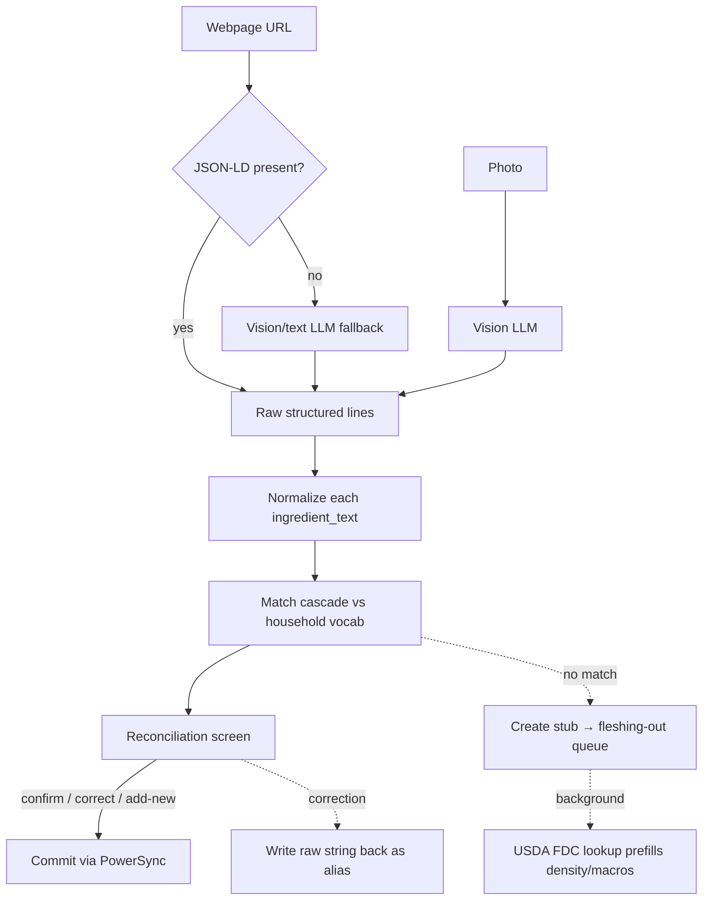

**Status:** Draft for review · **Scope:** Mise v1 · **Supersedes:** spec §5 (Import) mechanics
**One-liner:** Imports run online, so matching is a server-side job — the phone never fuzzy-matches. Extraction proposes, a human confirms, and corrections quietly grow the vocabulary.

---

## 1. Scope

This doc details two things the main spec left open: how ingredients are stored for matching, and how imported recipe lines are reconciled against them. It covers the full path from "paste a link / take a photo" to "recipe committed with every line resolved to a known ingredient or a stub."

**In scope:** intake, extraction, normalization, the match cascade, the reconciliation screen's data contract, the stub lifecycle, and the offline story.
**Out of scope:** the recipe page/cook mode UI, meal planning, the batch cook plan, and the shopping list (all covered elsewhere). The chip *rendering* lives with the recipe page, but the step storage model and the import-time alignment that feed it are specified here (§4.6). The unit system is assumed to exist already — it does not, everything here depends on it (spec §4, "build FIRST").

---

## 2. Key architectural decision — matching is online-only

Matching only ever happens at **import time**, and import is **always online** (we're either calling a vision model or fetching a webpage). Nothing offline needs to fuzzy-match: browse, cook, plan, and shop all operate on data that was already resolved at import.

This single observation removes the two hardest problems:

- No on-device embedding model.
- No shipping an 8,000-row reference vocabulary to the phone.

**Consequence:** the entire match engine lives server-side (Supabase Edge Function or Postgres RPC). PowerSync syncs only the human-readable, already-resolved ingredient rows down to the device for browse/cook. The match index and the large USDA reference set stay on the server.

Keep two paths mentally separate; they are different problems (see §10):

- **Machine proposes → human confirms** = import reconciliation. Online. Fuzzy.
- **Human picks directly** = the "Add ingredient" search screen during manual recipe editing. Offline. Exact/prefix lookup over a small synced set.

---

## 3. Pipeline overview

Webpage and photo diverge only at extraction. Everything downstream is shared.



The stages:

1. **Intake** — webpage or photo.
2. **Extraction** — emit a uniform set of raw lines regardless of source.
3. **Normalize** — clean each ingredient string before matching (§7).
4. **Match** — run the cascade, return ranked candidates with confidence tiers (§6).
5. **Reconcile** — the existing three-state screen (§8).
6. **Commit** — recipe rows and any new stubs write through the normal sync queue.

---

## 4. Extraction

### 4.1 Webpage

Try `schema.org/Recipe` JSON-LD first. It's structured, deterministic, and free — most recipe sites publish it. Only fall back to the LLM when JSON-LD is absent or malformed. This keeps the LLM off the majority of web imports.

### 4.2 Photo (incl. multi-page)

Straight to the vision LLM. Multi-page is **in scope for v1** — front + back of a recipe card, a two-page magazine spread. Pass all page images in a **single** vision call and let the model merge them into one recipe; this is simpler than stitching images beforehand and models handle multi-image messages well. Still one call per import, still one model (not a two-model pipeline — see §4.5).

### 4.3 Model choice

A Flash-tier multimodal generalist (Gemini Flash or GPT-5 Mini class). At household volume the cost is negligible — on the order of **$0.004 per import**, i.e. cents over the app's entire lifetime — so the model is chosen on extraction quality and latency, not price. Gemini Flash is the default for native image/PDF handling and speed; GPT-5 Mini is the marginally cheaper equivalent.

**The model does not see the ingredient vocabulary and does not match.** Its only job is to read the image/page and emit raw structured lines. Matching is our deterministic job (§6). This keeps the prompt small, avoids hallucinated matches, and makes the match step independently testable.

Use the provider's **native structured-output / JSON-schema mode**, not a "please reply in JSON" instruction — the reconciliation screen needs guaranteed-parseable output.

Resize images before upload (longest edge ~1,024–1,568px). Recipe text stays legible; a raw 12MP photo is wasted tokens.

### 4.4 Extraction output contract

```jsonc
{
  "title": "Weeknight Chicken Curry",
  "servings_base": 4,
  "image_quality": "ok",              // ok | degraded | poor
  "parse_warnings": [],               // e.g. "text cut off at bottom"
  "groups": [
    {
      "name": "for the curry",
      "line_items": [
        {
          "qty": 900,
          "unit": "g",
          "ingredient_text": "chicken thighs, boneless",  // as written
          "confidence": 0.97          // model's self-reported per-line confidence
        }
      ]
    }
  ],
  "steps": [                          // tokenized; mentions aligned to line-item index (§4.6)
    { "tokens": [ /* text / ref spans */ ], "timer_seconds": 600 }
  ]
}
```

`image_quality`, `parse_warnings`, and per-line `confidence` are the "this import looks shaky" signal — asked directly of the model in the same call, aimed precisely at flagging bad photos. This is cheaper and more targeted than cross-checking two models.

### 4.5 Cross-model consensus — deferred, with conditions

We considered running two models and comparing outputs to flag hard-to-parse cases. **Deferred**, because:

- Outputs are rarely textually identical even when both are correct ("2 garlic cloves" vs "2 cloves garlic"), so a naive string diff false-positives constantly and forces a semantic diff engine — the actual work, and its own source of bugs.
- The failure mode we care about (blurry photo) is exactly where two models can **agree and both be wrong** — correlated errors defeat the premise.
- There's already a human in the loop at reconciliation, so a disagreement flag gates nothing; it's a nice-to-have, not load-bearing.

**Cheaper flags we get first:** the model's self-reported `image_quality`/`confidence` (§4.4), and a high no-match rate at reconciliation (half the lines unmatched ≈ a parse that went sideways).

**If** the calibration eval (§11) shows bad images still slipping through unflagged, add a **coarse, document-level** consensus check between two *different* models: same ingredient count? same step count? quantities within ~10%? If those broad strokes disagree, flag the whole import "review carefully" and float it to the top of the queue. Never do per-line reconciliation between the two models — that's where effort-to-value collapses.

### 4.6 Step ↔ ingredient references ("chips")

Steps render with inline ingredient chips, and cook mode highlights the same references larger. The feature is easy *only* if the link from a step word to an ingredient is stored as **data**, not detected at render time. Runtime free-text detection would drag the exiled matching problem back onto the device (and it runs offline) — don't.

**Storage — tokenized steps, not strings.** A step is an ordered list of tokens: plain-text spans interleaved with ref tokens. A ref carries the line item(s) it points at and the surface label to show; it never stores a quantity.

```jsonc
{
  "tokens": [
    { "t": "text", "s": "Combine the " },
    { "t": "ref",  "refs": ["<line_item_id>", "<line_item_id>"], "label": "dry ingredients" },
    { "t": "text", "s": " in a bowl. Dice the " },
    { "t": "ref",  "refs": ["<line_item_id>"], "label": "onion" },
    { "t": "text", "s": " and soften." }
  ],
  "timer_seconds": 600
}
```

**The LLM only ever chooses a reference, never a number.** Chip quantities are looked up live from the referenced line item and scaled with everything else. The model picks *which* line item a word refers to; it never supplies the amount — so a chip can't invent or drift from a wrong quantity, and numbers can never contradict the ingredient list. The worst failure is a chip pointing at the wrong ingredient: visible on the page, one tap to fix.

**Alignment is by index, not vocabulary.** In the extraction call the model already has both the steps and the recipe's own ingredient lines, so it grounds each mention to a line item **by index into that same extraction** (§4.4). This is *not* vocabulary matching — it never touches the household vocab, so the §4.3 rule holds. On commit, indices remap to real `line_item_id`s. Because refs point at line items, chips inherit vocabulary resolution for free: once a line item resolves to "Yellow onion" at reconciliation, every chip referencing it shows that; a stub line item still chips fine (name only, no macros — consistent with the honest-numbers rule).

**Collective references — the "dry ingredients" case.** A ref may point at a *set* of line items. Two render rules keep this safe:

- **Quantity shows only on a single-ingredient chip.** A collective chip ("the dry ingredients") is a highlight aid with no number — you can't meaningfully sum flour + baking soda across units anyway, so the risky wrong-quantity mode simply doesn't exist for collectives. A wrong *member* is low-stakes and editable.
- **Quantity shows only on the first reference of a line item.** Later mentions of the same ingredient ("add the rest of the stock") render quantity-less. This covers split usage gracefully without modeling per-step sub-quantities — explicitly deferred (a large authoring-complexity jump for little v1 gain).

  *Worked example — split usage.* With 200 ml cream in the ingredient list, "Add half of the **cream `200 ml`**" (first reference, carries the number) and later "Add the rest of the **cream**" (quantity-less). The v1 chip shows the full line-item quantity, **not** the 100 ml that "half" implies — the number reflects the ingredient list, and "half"/"the rest" stay as plain prose. The trade: the number can't drift from the list and scales cleanly (double → 400 ml, "half" still reads "half"), at the cost of slightly overstating at the first mention.

  *Deferred extension — portion tokens.* If the overstatement ever matters, a ref can carry an optional `portion` the model tags from words like "half"/"the rest" (`half` → show `½ ×` or grey the number; `rest` → stay quantity-less). The chip still derives its number live from the line item (½ × 200 ml = 100 ml, always consistent with scaling); the model only *classifies* the phrase, never emits an amount — so this stays within "the LLM picks references, never numbers." The token model already has room for it, making this additive later, not a rework. Out of scope for v1 (it's the sub-quantity complexity deferred above).

**Degradation.** Any mention the model won't confidently link stays plain text. A step with zero refs is still a good step; a recipe with zero chips is still a good recipe. Prompt the model to link only when confident.

**Editing.** The manual editor gets an @-mention picker — tap an ingredient to drop a chip. Same token model, authored by hand instead of by the LLM.

---

## 5. Ingredient storage

### 5.1 Two-tier vocabulary — the biggest quality lever

Separate the thing you **match against** from the thing you **search when creating**:

- **`ingredient`** — the household's curated, lean vocabulary (~150–300 rows in practice). This is the match target and the only ingredient data that syncs to devices. Seeded small; grows through imports and stubs.
- **`usda_food`** — the full USDA FoodData Central reference (Foundation Foods + SR Legacy, CC0), read-only, **server-side only**. Used for the "create a new ingredient" search and for background stub prefill (§9). **Never matched against during import.**

Matching against 8,000 SR Legacy rows — where "chicken thigh" appears fifteen ways — produces constant wrong matches. Matching against the couple hundred ingredients the household actually uses is high-precision and easy. USDA is a lookup for *creation*, not a match target.

### 5.2 Data model

Extends spec §4's `ingredient`. Aliases become their own table (not the `aliases[]` array) so they can be trigram-indexed and so corrections write back cleanly.

```sql
-- household vocabulary: match target + syncs to device
create table ingredient (
  id              uuid primary key,
  household_id    uuid not null references household(id),
  canonical_name  text not null,
  category        text,
  default_unit    text not null,
  density_g_per_ml numeric,          -- nullable; stub until set
  macros          jsonb,             -- {kcal, protein, carb, fat}; nullable
  status          text not null,     -- 'complete' | 'stub'
  source          text,              -- 'usda_fdc:<id>' | 'manual' | 'barcode' | 'import_stub'
  match_text      text not null      -- normalized form of canonical_name (see §7)
);

create table ingredient_alias (
  id            uuid primary key,
  ingredient_id uuid not null references ingredient(id) on delete cascade,
  alias_text    text not null,       -- as originally seen/entered
  match_text    text not null,       -- normalized form
  source        text not null        -- 'seed' | 'import_correction' | 'manual'
);

-- read-only reference; server-side only; NOT synced, NOT matched at import
create table usda_food (
  fdc_id        int primary key,
  description   text not null,
  category      text,
  density_g_per_ml numeric,
  macros        jsonb,
  match_text    text not null
);

-- trigram indexes power the fuzzy cascade
create index ing_match_trgm   on ingredient       using gin (match_text gin_trgm_ops);
create index alias_match_trgm on ingredient_alias using gin (match_text gin_trgm_ops);
create index usda_match_trgm  on usda_food        using gin (match_text gin_trgm_ops);

-- optional, only if embeddings earn their place (see §6)
-- alter table ingredient add column embedding vector(384);
-- create index ing_embed_hnsw on ingredient using hnsw (embedding vector_cosine_ops);
```

`match_text` is computed by the normalization function on write (§7), not a pure generated column — normalization is more than lowercasing.

### 5.3 What syncs vs what stays server-side

| Data | Syncs to device? | Purpose |
|---|---|---|
| `ingredient` (resolved rows) | Yes | Browse, cook, manual "Add ingredient" search |
| `ingredient_alias` | Yes | Improves offline typo-tolerant search; small |
| `usda_food` | No | Server-only reference for creation + prefill |
| Match indexes | No | Server-only; matching is online |

---

## 6. The matching cascade

Server-side, called once per import with all lines batched. Runs cheap-to-expensive, stops when confident.

1. **Exact normalized** — `match_text` equality against `ingredient` + `ingredient_alias`. → auto-accept.
2. **Trigram / token-set** — `pg_trgm similarity()` over `match_text`. High score → auto-accept; mid score → the top-3 "did you mean?" suggestions.
3. **Semantic embedding** — cosine similarity, **only** for lines lexical missed ("cilantro" ↔ "coriander", "scallion" ↔ "green onion"). *Stretch — likely unnecessary for v1.* With well-seeded aliases, trigram + aliases handles most synonym cases. Ship without embeddings first; add only if the eval shows a real synonym gap.
4. **No match** — create a stub from the raw string (§9). The stub is immediately matchable for the rest of *this* import, so repeated lines dedupe onto one stub.

### Score bands → UI states

| Band (starting points — calibrate on §11) | Reconciliation state |
|---|---|
| ≥ 0.85 | Auto-matched (with undo / "wrong match") |
| 0.55 – 0.85 | "Did you mean?" — top-3 suggestions |
| < 0.55 | No match → "add new" (stub) |

Thresholds are guesses until tuned against the eval set.

---

## 7. Normalization — where match quality actually lives

Applied to both the incoming `ingredient_text` and, at write time, to every `canonical_name`/`alias_text` (producing `match_text`). Symmetric normalization is what makes the cascade work.

Rules:

- **Lowercase.**
- **Singularize** — "onions" → "onion". High value.
- **Strip the trailing comma modifier** — "chicken thighs, boneless" → "chicken thigh".
- **Strip prep verbs that never change identity** — chopped, diced, minced, sliced, grated.
- **KEEP form/state words that do change identity** — this is the common own-goal. "fresh ginger" ≠ "ground ginger"; "coconut milk, canned" ≠ "coconut cream". Over-aggressive stripping collapses distinct ingredients.

Worked examples:

| Raw | Normalized `match_text` |
|---|---|
| "2 large Onions, diced" | "onion" |
| "Chicken thighs, boneless" | "chicken thigh boneless" |
| "1 can coconut milk" | "coconut milk" |
| "fresh ginger, grated" | "ginger fresh" |

---

## 8. Reconciliation & the learning loop

The screen (already designed) presents each line in one of three states: auto-matched with an undo affordance, "did you mean?" suggestions, or add-new-stub.

**The learning loop — do this, it's nearly free and the highest-value low-effort feature in the pipeline.** When a user corrects a match (undoes an auto-match and picks another, or accepts a suggestion), write the original raw string back as a new `ingredient_alias` (`source = 'import_correction'`) on the chosen ingredient. Over a few weeks the vocabulary absorbs the household's actual phrasing ("coco milk" → Coconut milk, canned) and matching improves with zero ML.

---

## 9. Stub lifecycle

```
no-match line
   │
   ▼
create stub  (status='stub', density/macros null, source='import_stub')
   │
   ├──► lands in fleshing-out queue
   │
   └──► background job: search usda_food by match_text
             │
             └──► if confident hit, prefill density + macros (still 'stub' until user confirms)
   │
   ▼
user opens stub  →  confirms/edits density + macros  →  status='complete'
```

Until a stub is complete, it is left out of unit conversions and macro totals (spec's "honest numbers" rule). The background USDA lookup means that when the user opens the stub, the fields are usually already populated — closing the loop back to the "New ingredient" screen.

---

## 10. Offline vs online search — two jobs, one underlying tool

The dividing line is **not fuzzy vs. exact** — both sides tolerate typos. It's **who acts on the result**:

- **Retrieval for a human to pick** (offline, easy). The manual "Add ingredient" screen. Typo tolerance is welcome — "chikn" should surface "Chicken thigh" in the list. It only has to rank the right row into a short, visible set; the human filters, so nothing needs calibration. Over the ~150–300 synced household rows this is trivial: SQLite FTS5 with the trigram tokenizer, or even an in-memory edit-distance pass in Dart. Works offline.
- **Automated matching that commits a decision** (online, hard). Import reconciliation. Auto-accepts above a threshold, produces confidence bands, may use embeddings, and runs against the larger/ambiguous corpus. This is the part that must stay server-side.

| | Human picks (manual add) | Machine proposes (import) |
|---|---|---|
| **When** | Manual recipe editing | Import reconciliation |
| **Online?** | Works offline | Always online |
| **Approx. matching?** | Yes — typo-tolerant retrieval | Yes — full ranked cascade |
| **Acts unattended?** | No — human picks from a list | Yes — auto-accepts above threshold |
| **Corpus** |